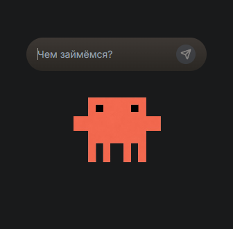

🇷🇺 [Русская версия](README.ru.md)

# 🤖 Klodik

[](https://tauri.app)
[](https://react.dev)
[](https://typescriptlang.org)
[](https://tailwindcss.com)
[](https://python.org)
[](https://groq.com)
[](LICENSE)

> **Your desktop companion.** Klodik — a pixel-art AI agent that lives on your screen, talks to you in Russian, and actually does things — opens apps, types text, searches Google, moves your mouse, and remembers your habits.

<p align="center">
  
</p>

---

## ✨ Features

| Feature | Description |
|---------|-------------|
| 🎮 **Desktop Overlay** | Transparent, frameless, always-on-top window. Drag it anywhere |
| 🗣️ **Russian-only** | Speaks like a human in a messenger — short, casual, sarcastic |
| 🧠 **Groq LLM** | Powered by `llama-3.3-70b-versatile` — fast, smart, 70B parameters |
| 🔧 **Tool Calling** | 15+ tools: terminal, files, mouse, keyboard, browser, search |
| 🧠 **Multi-model** | Groq, OpenAI, Gemini, Ollama — pick your provider |
| 📝 **Memory** | SQLite database remembers recent conversations and preferences |
| 🎬 **Animations** | Lottie animated sprite when working, idle pixel-art when chill |
| 🪟 **Taskbar** | Visible in taskbar — easy to find and switch to |
| 💬 **Initiative** | Gets bored and starts conversation himself after 60s of silence |

---

## 🏗️ Architecture

```
┌─────────────────────────────────────┐
│  Tauri Window (transparent overlay)   │
│  ┌─────────────────────────────┐    │
│  │  React 19 + Tailwind v4    │    │
│  │  ├── Agent.tsx (sprite)    │    │
│  │  ├── useWebSocket.ts       │    │
│  │  └── ErrorBoundary.tsx      │    │
│  └─────────────────────────────┘    │
└──────────────┬────────────────────────┘
               │ WebSocket  ws://localhost:8765
               ▼
┌─────────────────────────────────────┐
│  Python Sidecar (FastAPI + uvicorn) │
│  ├── WebSocket /ws                  │
│  │   └── agent_loop()              │
│  │       ├── LLM (litellm)         │
│  │       ├── SQLite Memory         │
│  │       └── 15+ Tools             │
│  ├── connection.py (WS manager)     │
│  ├── log.py (colored logging)       │
│  └── /health                        │
└─────────────────────────────────────┘
               │
               ▼ HTTPS
        ┌──────────────┐
        │  Groq Cloud  │
        │  70B params  │
        └──────────────┘
```
---

<p align="center">
  
</p>

---

## 🚀 Quick Start

### Prerequisites
- [Node.js](https://nodejs.org/) + [pnpm](https://pnpm.io/)
- [Python 3.12+](https://python.org)
- [Rust](https://rustup.rs/) (for Tauri)
- Windows 10+ / macOS 12+ / Linux with X11/Wayland (for pyautogui)

### Install

```bash
# Clone
git clone https://github.com/elev1e1nSure/klodik.git
cd klodik

# JS dependencies
pnpm install

# Python virtual environment + dependencies
python -m venv sidecar\.venv
sidecar\.venv\Scripts\pip install -r sidecar\requirements.txt

# Create .env (required!)
copy .env.example sidecar\.env
# Edit sidecar\.env and paste your GROQ_API_KEY
```

### Run

```bash
# Beautiful launcher with provider & model selection
pnpm launch

# Or classic unified launch
pnpm dev:all
```

Or separately:
```bash
# Terminal 1
sidecar\.venv\Scripts\python.exe sidecar\main.py

# Terminal 2
pnpm tauri dev
```

---

## 🛠️ Tools

The agent can perform real actions on your computer:

| Tool | What it does |
|------|-------------|
| `terminal` | Run shell commands |
| `read_file` / `write_file` | File operations |
| `mkdir` / `list_dir` | Directory management |
| `search` | Find files by name or content |
| `move_file` | Move/rename files |
| `move_mouse` / `click` | Control cursor |
| `type_text` / `press_key` | Keyboard input |
| `open_app` | Launch applications |
| `open_url` | Open links in browser |
| `google` | Search Google and return results |
| `read_url` | Fetch webpage content |

---

## 🧠 Memory

Conversations are stored in `sidecar/memory.db` (SQLite). The agent loads the last 5 interactions before each task to maintain context and remember your preferences.

---

## 📁 Project Structure

```
klodik/
├── src/               # React frontend
├── src-tauri/         # Tauri (Rust) desktop shell
├── sidecar/           # Python backend (FastAPI + agent)
│   ├── connection.py  # WebSocket connection manager
│   ├── log.py         # Structured colored logging
│   └── tools/         # Tool registry & implementations
├── scripts/           # dev.cjs — unified launch script
├── public/            # Sprites and assets
└── AGENTS.md          # Project rules & conventions
```

---

## 🧠 Providers & Models

| Provider | Models | API Key Required |
|----------|--------|-----------------|
| ⚡ **Groq** | llama-3.3-70b, mixtral, gemma2 | Yes ([console.groq.com](https://console.groq.com/keys)) |
| 🌐 **OpenAI** | gpt-4o, gpt-4o-mini, gpt-4-turbo | Yes ([platform.openai.com](https://platform.openai.com/api-keys)) |
| 💎 **Gemini** | gemini-1.5-pro, gemini-1.5-flash | Yes ([aistudio.google.com](https://aistudio.google.com/app/apikey)) |
| 🦙 **Ollama** | llama3, mistral, codellama, etc. | No (local) |

Set provider via `pnpm launch` or in `.env` (`PROVIDER=...`).

## 🩹 Troubleshooting

| Issue | Fix |
|-------|-----|
| `GROQ_API_KEY not set` | Copy `.env.example` to `sidecar\.env`, paste key from [console.groq.com](https://console.groq.com/keys) |
| Port 8765 in use | Change `WS_PORT` in `.env` or kill the process on 8765 |
| `pyautogui not installed` | Install deps: `pip install -r sidecar\requirements.txt` |
| macOS: pyautogui fails | System Preferences → Security → Accessibility → add Python/terminal |
| Window not draggable | Ensure `data-tauri-drag-region` is on the root div |

## 📜 License

MIT

